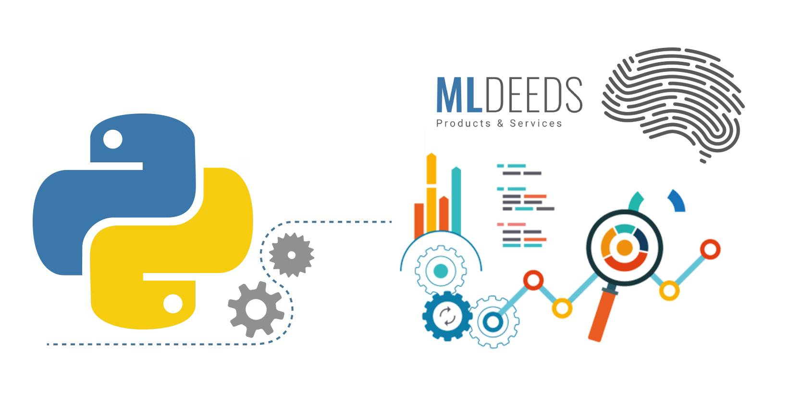

# Data Science in Python Course Syllabus

  
<b>Machine Learning in Python (Fundamental)</b>

- Steps of ML Algorithms
  - Data Gathering
  - Data Preparation
  - Data Exploration
  - Training
  - Testing and Evaluation
    - Evaluation Criteria
      - Error Rate
      - Precision
      - Recall
- Supervised Learning
  - Classification
    - Task Intro
    - k-Nearest Neighbors (KNN)
      - Algorithm Intro
      - Loading and Parsing Data
      - Distance Measurements
      - Normalizing Values
      - Testing the Classifier
      - Project: Handwritten Digits Recognition
    - Decision Trees
      - Algorithm Intro
      - Information Gain
      - Splitting Data
        - Finding the Best Feature to Split on
        - Tree-building
      - Plotting the Tree
      - Testing the Classifier
      - Project: Buying a Car
    - Naïve Bayes
      - Algorithm Intro
      - Probability Theory
        - Bayesian Decision Theory
        - Conditional Probability
      - Classification based on Probabilities
      - Bag of Words (BoW) Model
      - Modifying the Classifier
      - Testing the Classifier
      - Displaying the Targets
      - Project: Text (Documents) Classification
      - Project: Junk Email Classification

  
<b>Machine Learning in Python (Supervised Learning I)</b>

- Supervised Learning
  - Classification
    - Logistic Regression
      - Task Intro
        - The Sigmoid Function
      - Classification with Logistic Regression
      - Optimization
        - Finding the Best Coefficients
        - Gradient Ascent Optimization (GAO)
        - Gradient Descent Optimization (GDO)
      - Plotting the Decision Boundary
      - Missing Values
      - Project: Finding Important Academic Factors for Job Seekers
    - Support Vector Machines (SVM)
      - Algorithm Intro
      - Data Separation
        - Finding the Maximum Margines
      - Optimization
        - Platt’s SMO Algorithm
      - Kernels
        - Data Mapping
      - Testing the Algorithm
      - Project: Handwritten Digits Recognition
    - AdaBoost
      - Algorithm Intro
      - Combining Classifiers
      - Bagging
      - Boosting
      - Improving the Classifier
      - Weak Learners
      - Testing the Classifier
      - Project: Handwritten Digits Recognition
    - XGBoost
      - Algorithm Intro
      - Get Started with XGBoost
        - Boosted Trees
        - Model IO
      - Gradient Boosting
      - Parameters
      - Random Forests in XGBoost

  
<b>Machine Learning in Python (Supervised Learning II)</b>

- Supervised Learning
  - Regression
    - Linear Regression
      - Task Intro
      - Best-fit Lines
      - Standard Regression Function
      - Locally Weighted Function
      - Ridge Regression
        - Coefficients
      - Forward Stagewise Regression
      - Project: Age Prediction
    - Tree-based Regression
      - Task Intro
      - Modeling Complex Data
      - Tree Building
        - Continuous Features
        - Discrete Features
        - CART Approach
      - Tree Splitting
      - Tree Pruning
        - Prepruning
        - Postpruning
      - Model Trees
      - Project: Price Prediction
    - Time Series Regression
      - Task Intro
      - Analyzing Time Series Data
        - Serial Correlation
      - General Assumptions
      - Using Regression Models for Forecasting
      - Autoregressions
        - Models
        - Forecast Errors
      - Algorithms
      - Project: Weather Temperature Forecast
      - Project: GDP Growth Forecasting

  
<b>Machine Learning in Python (Unsupervised Learning)</b>

- Unsupervised Learning
  - Clustering
    - Task Intro
    - k-Means Clustering
      - Algorithm Intro
      - Support Functions
      - Post-processing and Performance Improvement
      - Bisecting k-means
      - Project: Clustering Geo-coordinates
    - Fuzzy Clustering
      - Algorithm Intro
      - Fuzzy Logic
        - Introduction
        - Fuzzy Sets
        - Fuzzy Operations
        - Fuzzification and Defuzzification
      - Analyzing Data Points
        - Initialization
      - Finding Out the Centroid
      - Distance Measurement
      - Project: Car Engine Performance Modeling
  - Association Rule Mining
    - Apriori Algorithm
      - Algorithm Intro
        - Principles
      - Association Mining and Analysis
      - Finding Frequent Itemsets
      - Mining Association Rules
      - Project: Voting Patterns Analysis
    - FP-growth
      - Algorithm Intro
      - Finding Common Patterns
      - FP-trees
        - Data Structure
        - Construction of Trees
        - Mining Frequent Items
        - Pattern Extraction
      - Project: Finding Co-occurring Words

  
<b>Feature Engineering and Data Pre-processing</b>

- Working on Data
  - Data Preprocessing
    - Aggregation
    - Sampling
    - Dimensionality Reduction
    - Discretization and Binarization
  - Dataset Balancing
    - Imbalanced Data Challenges
    - Choosing Proper Evaluation Metric
    - Training Set Resampling
      - Under-sampling
      - Over-sampling
      - Ration Seletction
    - K-fold Cross-Validation
  - Data Testing
  - Outlier Detection
    - What is Outlier Data
    - Overview of Outlier Detection Methods
      - Isolation Forest
      - Local Outlier Factor
      - One-Class SVM (SGD)
      - Robust Covariance
    - Novelty Detection
- Principal Component Analysis (PCA)
  - Task Intro
  - Data Simplification
  - Dimensionality Reduction
    - Goals
  - PCA Concepts
    - Moving the Coordinate Axes
    - A Usage Example in NumPy
    - Missing Values Replacement
  - Project: Dimensionality Reduction in Factories Data
- Singular Value Decomposition (SVD)
  - Task Intro
  - Matrix Factorization (MF)
  - Latent Semantic Indexing (LSI)
  - Applications in Practice
    - Recommender Systems (RecSys)
      - Collaborative Filtering
      - Measuring Similarity
        - Item-based Similarity
        - User-based Similarity
      - Rating Estimation
  - SVD in Python
  - Project: Food Recommender
  - Project: Fashion Recommender
  - Project: Image Compression
- Big Data
  - Task Intro
  - MapReduce
    - Algorithm Intro
    - Applications
  - Hadoop Streaming
    - Intro
    - Distributed Mapper/Reducer
    - Mrjob in Python
    - Running Jobs in AWS
    - Running Jobs in EMR
  - Project: Distributed SVM

